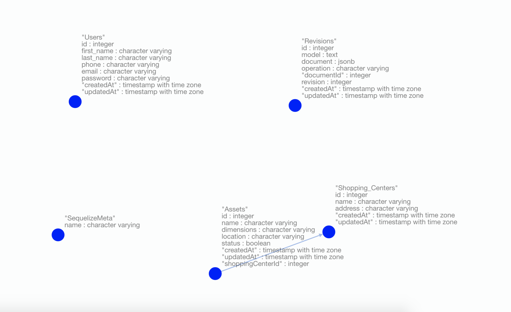

# inventory-management

## Demo:

## Platform

A Shopping Centre is a mall like Pacific Mall (West Delhi); placed at key locations within the Shopping Centre are the Assets i.e. the physical panels. Shopping Centres must at a minimum have the attributes: Name, address, and have Assets associated with them.

An Asset is a physical screen which receives advertisement and other content throughout the day. It has physical attributes such as its dimensions, a location within the shopping centre, and a status indicating whether it is active to receive content or offline for
maintenance.

Assets must at a minimum have the attributes: Name, physical dimensions, associated Shopping Centre, location within the centre, and status.

## Schema

### Table and attributes

Table: `shopping_centers`
Attributes: _id_, _name(String)_, _address(String)_, _assets(association-id)_

Table: `assets`
Attributes: _id(association-id)_, _name(String)_, _dimensions(String)_, _location(String)_, _status(bool)_,

## Making use of

Express framework
https://expressjs.com

Postgresql
https://www.postgresql.org/docs/

Sequelize:
http://docs.sequelizejs.com/manual/installation/usage.html

## PSQL setup:

- create superuser;
- psql;
- createuser -P -s -e developer; // Password: abc123
